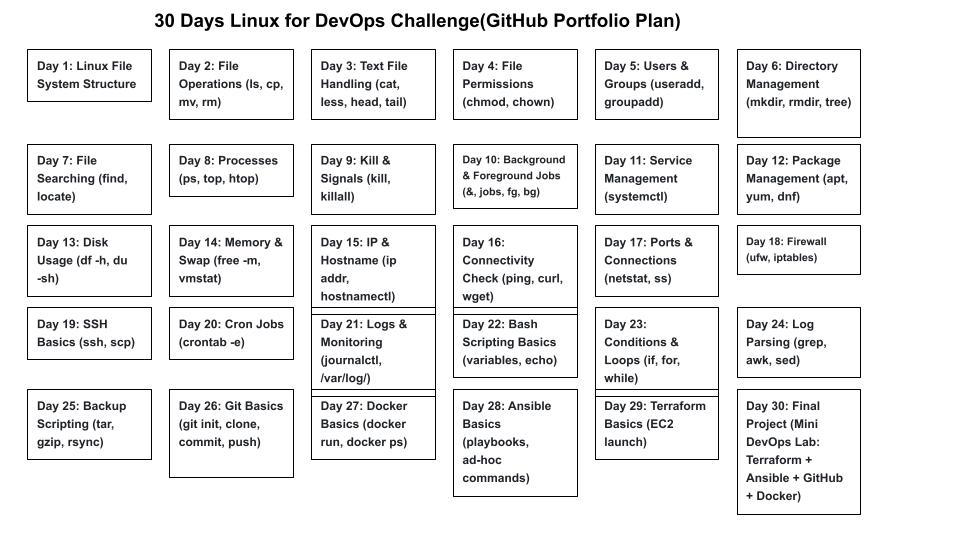

# 🐧 30 Days Linux for DevOps Challenge

## 📅 Week 1: Linux Basics

Day 1: Linux File System Structure

Day 2: File Operations (ls, cp, mv, rm)

Day 3: Text File Handling (cat, less, head, tail)

Day 4: File Permissions (chmod, chown)

Day 5: Users & Groups (useradd, groupadd)

Day 6: Directory Management (mkdir, rmdir, tree)

Day 7: File Searching (find, locate)

## 📅 Week 2: Process & System Management

Day 8: Processes (ps, top, htop)

Day 9: Kill & Signals (kill, killall)

Day 10: Background & Foreground Jobs (&, jobs, fg, bg)

Day 11: Service Management (systemctl)

Day 12: Package Management (apt, yum, dnf)

Day 13: Disk Usage (df -h, du -sh)

Day 14: Memory & Swap (free -m, vmstat)

## 📅 Week 3: Networking & Security

Day 15: IP & Hostname (ip addr, hostnamectl)

Day 16: Connectivity Check (ping, curl, wget)

Day 17: Ports & Connections (netstat, ss)

Day 18: Firewall (ufw, iptables)

Day 19: SSH Basics (ssh, scp)

Day 20: Cron Jobs (crontab -e)

Day 21: Logs & Monitoring (journalctl, /var/log/)

## 📅 Week 4: Scripting & DevOps Tools

Day 22: Bash Scripting Basics (variables, echo)

Day 23: Conditions & Loops (if, for, while)

Day 24: Log Parsing (grep, awk, sed)

Day 25: Backup Scripting (tar, gzip, rsync)

Day 26: Git Basics (git init, clone, commit, push)

Day 27: Docker Basics (docker run, docker ps)

Day 28: Ansible Basics (playbooks, ad-hoc commands)

Day 29: Terraform Basics (EC2 launch)

Day 30: Final Project (Mini DevOps Lab: Terraform + Ansible + GitHub + Docker)